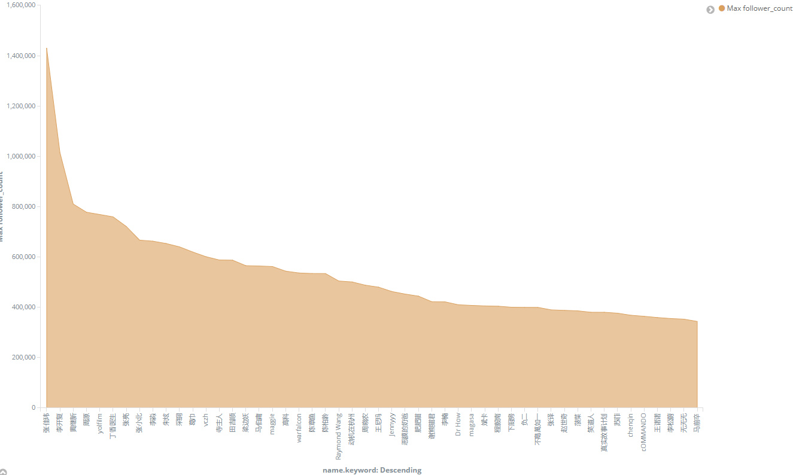
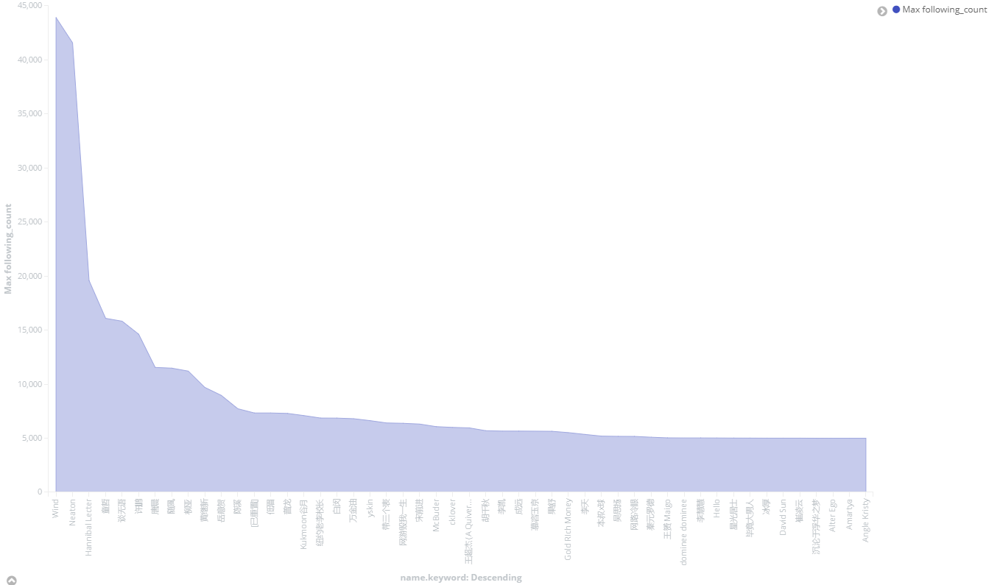
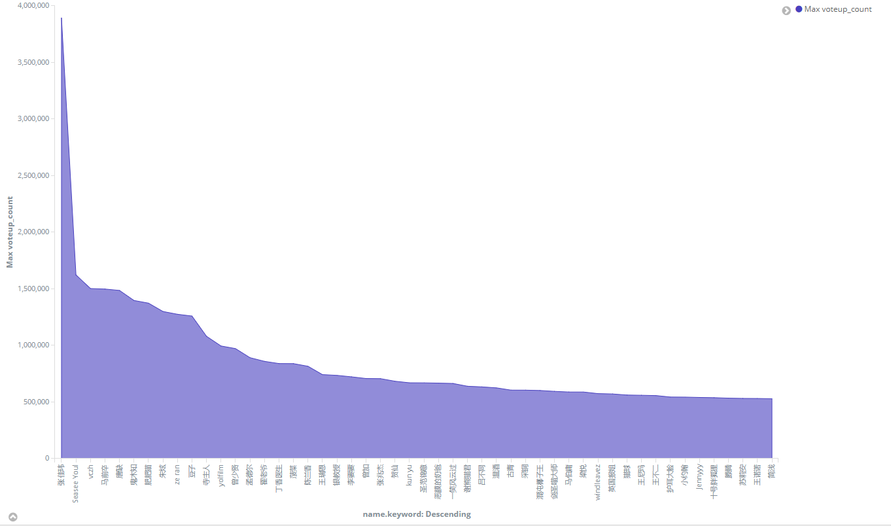
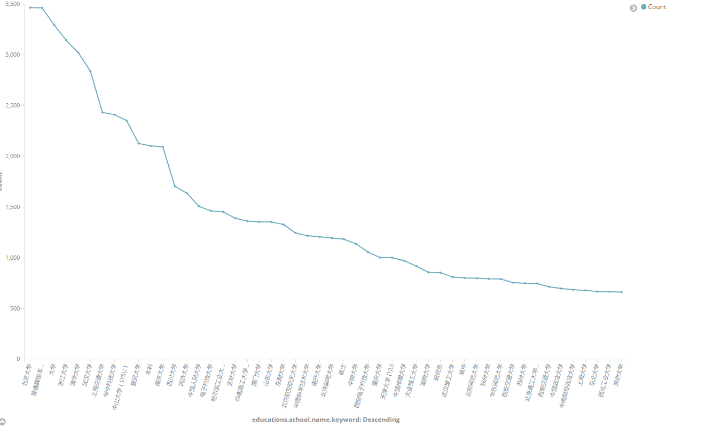
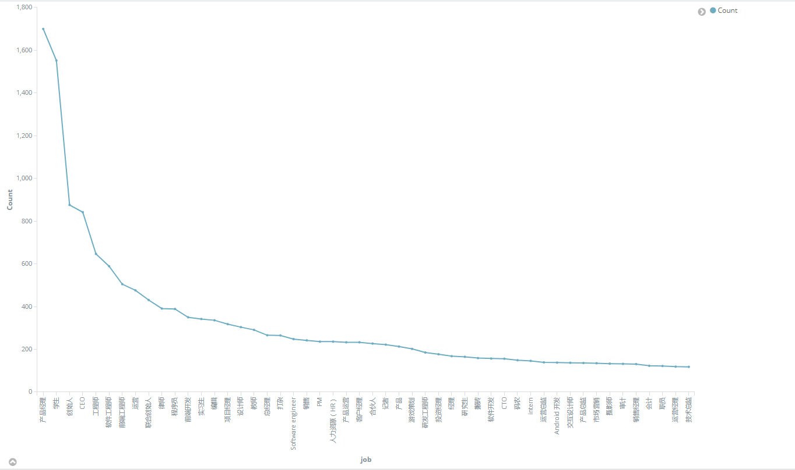

这是一个知乎爬虫项目
============

## 根据知乎用户爬取所有和用户相关的数据

  数据包括关注者,被关注者,文章,专栏,想法,提问,答案,和用户相关的其他信息

### 应的框架有
1. jdk1.8
2. spring-boot --基本架构
3. spring-data-elastic --elastic客户端
4. elasticsearch --搜索引擎,也用于存储数据
5. kinaba --数据展示和分析
6. 爬取网页用的spring提供的restTemplate

 ### 说明
 1. 使用spring的resttemplate抓去知乎的接口
 2. 使用数据线程池实现多线程抓取
 3. 记录上次停顿的位置实现连续抓取
 4. 控制抓取的数据类型
 5. 去重使用的是elsstic提供的upset方法,id的话,people使用url_token
 6. 当访问被限制的时候切换本地的http代理,不想找线程池,所以一般只开两个线程进行抓取,不得不说知乎反爬虫做的挺好,只开一个线程的时候不会被屏蔽,多了就不行了
 7. 跑了一个星期大概抓取了200W的用户数据和其他的一些
 8. 先爬取几条记录,然后代码就会自动把记录写入任务队列中
 9. 使用java.util.concurrent里面的很多包进行多线程访问的限制,比如缓存线程池,阻塞队列,atomic原子操作类等
### 安装和配置
* elasticSearch5.5
```
    cd /apps/
    #下载
    wget https://artifacts.elastic.co/downloads/elasticsearch/elasticsearch-5.6.0.zip
    #解压缩
    unzip
    cd elasticsearch-5.6.0
    #改变配置
    vim config/elasticsearch.yml
    #配置外网访问
    network.host : 0.0.0.0
    #cluster名称
    cluster.name: elasticsearch
    #节点名称
    node.name: node-1
    #启动 bin/elasticsearch -d
    #注意因为安全设置elasticsearch不允许用root用户访问,所以新建一个用户用于启动这个服务
    
```
* kibana安装
```
#和上面差不多,略过了
```
* jdk1.8安装
```
#详见网上ubuntu安装jdk的教程,有很多,就不贴了
```
* spring-boot版本的选择
```
elasticsearch更新比较快
springboot-release版本可能不太适配
现在只能使用2.0.0.M3版本
如果用在正式环境中,可能需要降低elasticsearch,或者再等几个月等springboot的适配
```
* pom.xml
```
    <parent>
        <groupId>org.springframework.boot</groupId>
        <artifactId>spring-boot-starter-parent</artifactId>
        <version>2.0.0.M3</version>
    </parent>
     <dependency>
                <groupId>org.springframework.boot</groupId>
                <artifactId>spring-boot-starter-data-elasticsearch</artifactId>
    </dependency>
    <dependency>
        <groupId>org.springframework.boot</groupId>
        <artifactId>spring-boot-starter-web</artifactId>
    </dependency>
    <build>
        <plugins>
            <plugin>
                <groupId>org.springframework.boot</groupId>
                <artifactId>spring-boot-maven-plugin</artifactId>
            </plugin>
        </plugins>
    </build>
```
* 配置application.properties
```
spring.data.elasticsearch.cluster-nodes=192.168.56.101:9300
server.port=80
logging.level.root=info
logging.file=D://log.log

```

* 启动类和一些配置
```
@SpringBootApplication(scanBasePackages = "ren.superk")
@EnableElasticsearchRepositories(basePackages = "ren.superk")
public class ElasticSearchApplication implements CommandLineRunner {
    public static void main(String[] args) {
        SpringApplication.run(ElasticSearchApplication.class,args);
    }


    @Autowired
    private PeopleService peopleService;
    @Override
    public void run(String... strings) throws Exception {
        peopleService.initDataByThreadCount(2);
    }
}


@Configuration
public class RestTemplateConfig{
    @Bean
    public RestTemplate restTemplate(ClientHttpRequestFactory factory){
        return new RestTemplate(factory);
    }

    @Bean
    public ClientHttpRequestFactory simpleClientHttpRequestFactory(){
        SimpleClientHttpRequestFactory factory = new SimpleClientHttpRequestFactory();
        factory.setReadTimeout(5000);//ms
        factory.setConnectTimeout(15000);//ms
        return factory;
    }
}
```
* 文件路径
```
使用命令行工具 tree /F .\springboot-spider\src\main > d:/tree.txt 

├─java
│  └─ren
│      └─superk
│          └─zhihu
│              ├─action
│              │      PeopleAction.java    --action接口,写了3个方法
│              │      
│              ├─config                      -- 配置
│              │      ElasticSearchApplication.java
│              │      ElasticSearchConfig.java
│              │      RestTemplateConfig.java
│              │      
│              ├─core                        --核心枚举,和类型相关的参数都存在美剧中
│              │      SortEnum.java
│              │      ZhihuEnum.java
│              │      
│              ├─model                       --实体类
│              │      Answer.java
│              │      Article.java
│              │      Columns.java
│              │      Education.java
│              │      Employment.java
│              │      Fav.java
│              │      People.java
│              │      Pins.java
│              │      Question.java
│              │      Relation.java
│              │      Topic.java
│              │      ZhihuAnswerPager.java  --这几个本来设计的有用,但废弃掉了
│              │      ZhihuArticlePager.java --这几个本来设计的有用,但废弃掉了
│              │      ZhihuColumnsPager.java --这几个本来设计的有用,但废弃掉了
│              │      ZhihuFavPager.java     --这几个本来设计的有用,但废弃掉了
│              │      ZhihuPager.java
│              │      ZhihuPeoplePager.java  --这几个本来设计的有用,但废弃掉了
│              │      ZhihuPinsPager.java    --这几个本来设计的有用,但废弃掉了
│              │      ZhihuQuestionPager.java --这几个本来设计的有用,但废弃掉了
│              │      ZhihuTopicPager.java  --这几个本来设计的有用,但废弃掉了
│              │      
│              ├─repository
│              │      PeopleRepository.java  --elasticsearch-spring-data的从IDUS方法
│              │      RelationRepository.java
│              │      
│              └─service
│                  │  PeopleService.java    --服务
│                  │  PeopleUrlService.java --网络服务
│                  │  
│                  └─impl
│                          PeopleServiceImpl.java  -- 主要的方法都写在这里面
│                          PeopleUrlServiceImpl.java
│                          test.java
│                          
└─resources
        application.properties  --配置
```
    

 


 一些简单的分析,见笑了
 ---------
 
 
 关注的人最多的人
 
 
 被关注的人最多的人
 
 
 
 感谢最多的
 
 
 
 学校 比较有趣
 
 
 
 回答问题最多,真劳模
 
 
 
 提问最多
 
 
 
 提问最多的主题,有趣
 
 
职位,也很有趣

 看图把,我不贴了


